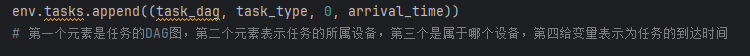
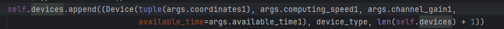
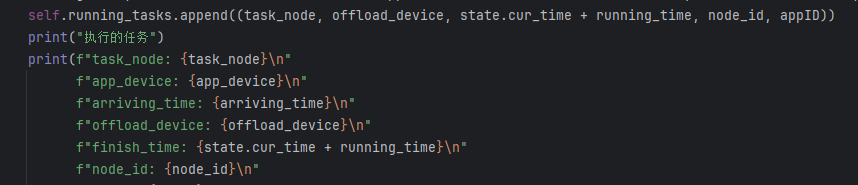

# 强化学习

状态空间由环境设备状态，和任务队列里面的任务的状态投影。


动作就是就绪任务队列里面的任务的编号。


Environment里要有，任务队列，设备队列。观察函数（生成状态），get_action函数生成动作的


### State有关:

​	pending_tasks: 每个元素都是是一个五元组，包括任务节点本身,任务所属设备，任务的到达时间，任务在AppDAG图内的ID和任务所属的AppID
​	ready_tasks: 每个元素是一个五元组，包括任务节点本身,任务所属设备，任务的到达时间，任务在AppDAG图内的ID和任务所属的AppID


### TaskDAG有关:

​	TaskDAG中的每一个node是一个二元组，第一个值是node的index第二个为一个TaskNode节点

​	Task里面再加一个调度rank队列，每次schduling时向里面加入任务以记录调度顺序

### EnvInit有关：

Env中的tasks：一个四元组



Env中的Devices:

其中每个元素是一个三元组，第一个元素是Device类，第二个元素是Device的类别，第三个元素表示Device的ID



Env中的running_tasks

self.running_tasks = [] #每个元素是一个五元组，包括任务节点本身,任务执行的设备，任务的完成执行时间，任务在AppDAG图内的ID和任务所属的AppID




### Device有关

```
self.coordinates = coordinates  # 设备当前位置
self.computing_speed = computing_speed # 设备计算速度
self.channel_gain = channel_gain       # 设备信道增益
self.available_time = available_time  # 可获得时间初始化为 0,表示一开始为空闲的
```

## 存在的问题

1.任务没有运行完成之前，ready_tasks中的任务可能和running_tasks中任务重，已经在running_tasks的任务不应该再在read_tasks中出现。目前的解决方案是再加一个task_node_running_flag数组标识。

2.第二个问题就是循环可能会空转也就是被依赖任务没有被完成所以后续任务无法被调度只有等时间慢慢过去等到完成了才有新的任务被调度也就是说在强化学习的过程中很多时候action中没有动作（可以设置一下奖励这个地方）。
